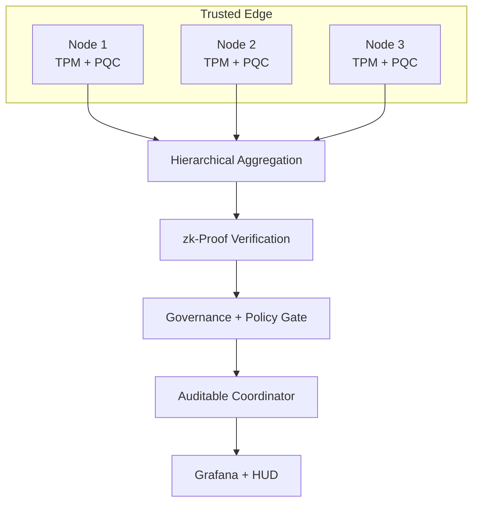
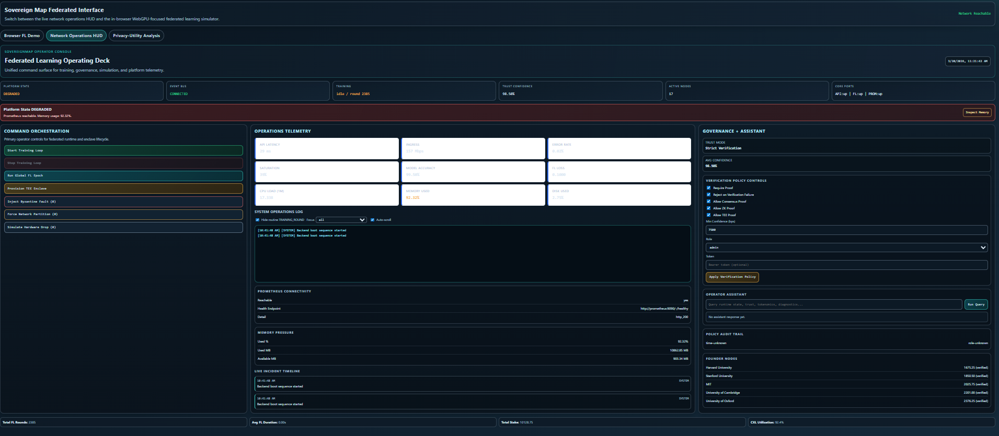
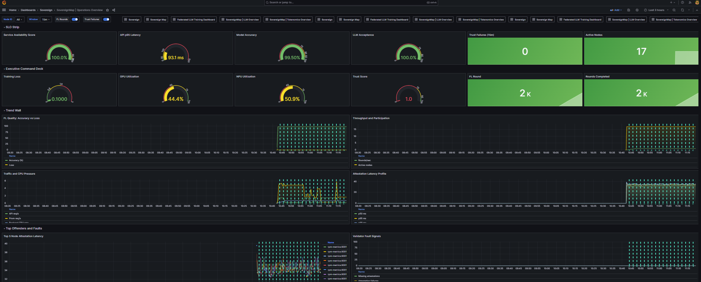
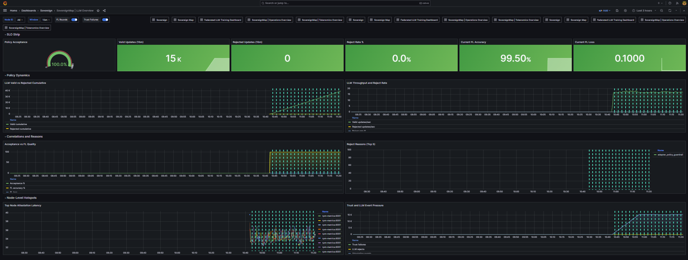
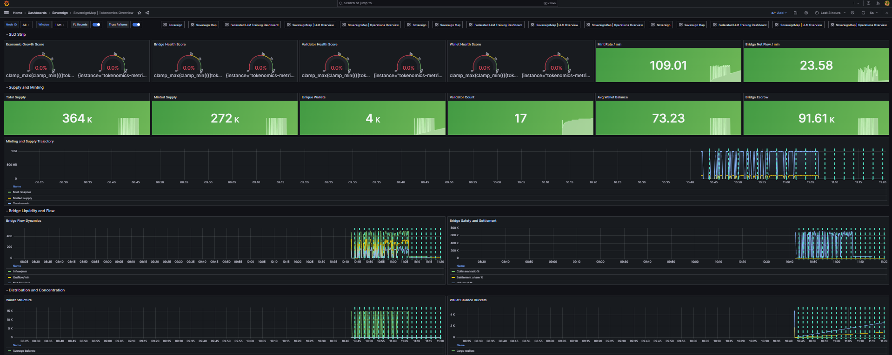
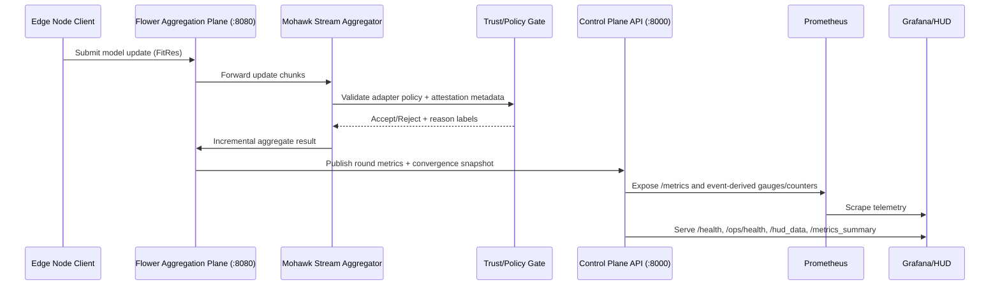

<!-- markdownlint-disable MD013 -->

# Sovereign Map Federated Learning

> **Sovereign Mohawk Proto: A formally verified federated learning runtime that scales to 10 million nodes with Byzantine resilience and quantum-resistant security - while keeping data private on the edge.**

Federated learning breaks down at massive scale when trust has to be assumed, communication becomes the bottleneck, and a single coordinator becomes a failure domain. Sovereign Mohawk Proto addresses that by using hierarchical aggregation, inline verification, TPM-backed sovereignty, and a post-quantum migration path so edge data stays private while the system remains auditable. The result is a control plane that can be inspected, verified, and scaled instead of just hoped for.

[](https://github.com/rwilliamspbg-ops/Sovereign_Map_Federated_Learning/actions/workflows/build.yml)
[](https://go.dev/)
[](LICENSE)
[](https://github.com/rwilliamspbg-ops/Sovereign_Map_Federated_Learning/stargazers)
[](https://github.com/rwilliamspbg-ops/Sovereign_Map_Federated_Learning/network/members)
[](Documentation/README.md)
[](results/README.md)
[](results/README.md)
[](README.md#quantum-kex-rotation-drill-genesis-testnet)
[](README.md#technical-brief)
[](https://discord.gg/raBz79CJ)

## Why It Matters

Traditional federated learning can look simple in a lab and fail badly in the field: trust assumptions accumulate at the coordinator, bandwidth becomes the limiting factor, and one weak service can stall the whole training loop. This runtime shifts that model to hierarchical aggregation with inline zk-proof verification, TPM-backed node sovereignty, and a post-quantum migration plan so each round is harder to fake and easier to audit. It is meant for fleets where privacy, scale, and verifiability are all required at the same time.

## What You Get in 60 Seconds

- One command boots the full stack and its observability surfaces.
- A small local node set exercises aggregation, policy checks, and proof verification.
- The runtime exposes the same health path operators use in production-style demos.
- The primary HUD and C2 view share a structured AI interaction summary so common actions stay explainable and easy to trigger.
- The HUD now includes a review drawer and backend decision history so AI-suggested actions can be approved, edited, rejected, or undone with an audit trail.

## Try It Now

Fastest path:

```bash
make sandbox-up
```

Then open:

- HUD: `http://localhost:3000`
- Grafana: `http://localhost:3001`
- Prometheus: `http://localhost:9090`

Other low-friction entry points:

- Verify the running stack: `make stack-verify`
- Browser-friendly notebook demo: [examples/pysyft-integration/pysyft_mohawk_poc.ipynb](examples/pysyft-integration/pysyft_mohawk_poc.ipynb)
- Notebook-backed integration PoC: [examples/pysyft-integration/README.md](examples/pysyft-integration/README.md)
- Public landing page source: [docs/index.md](docs/index.md)

## Visual Snapshot



<!-- markdownlint-disable MD033 -->

<p align="center">
    
    
</p>

<p align="center">
    
    
</p>

## How It Compares

| Capability | Sovereign Mohawk Proto | NVIDIA FLARE | PySyft |
| --- | --- | --- | --- |
| Scale posture | Hierarchical aggregation designed for very large edge fleets | Enterprise FL orchestration with coordinator-centric flows | Privacy-preserving workflows with policy-based data access |
| Trust model | TPM-backed sovereignty, inline verification, and auditable control paths | Policy and orchestration focused; trust is usually externalized to deployment | Strong privacy controls; verification depends on the integration pattern |
| Verification | zk-proof oriented round verification and auditable checkpoints | Typically relies on platform controls and deployment discipline | Privacy-first, but not a native zk-verification stack |
| Edge privacy | Data stays on the edge; only verified updates move upstream | Supports distributed training, but privacy depends on your deployment | Built to support private data workflows and datasite-style control |
| PQC path | Explicit post-quantum migration track | Not a default project-level emphasis | Not a default project-level emphasis |

<details>
<summary>Advanced Theorems and Proof Notes</summary>

- The deeper formalization and runtime assumptions are tracked in the technical brief and roadmap sections below.
- The published verification numbers in the badges are project metrics, not universal guarantees.
- For the broader research context, see [Documentation/README.md](Documentation/README.md) and [Documentation/Project/ROADMAP.md](Documentation/Project/ROADMAP.md).

</details>

<!-- markdownlint-enable MD033 -->

## Community and Contribution

The project is open to contributors who want to work on practical scale and verification problems.

- Good first issues: [CONTRIBUTING.md](CONTRIBUTING.md)
- Code of conduct: [CODE_OF_CONDUCT.md](CODE_OF_CONDUCT.md)
- Security policy: [SECURITY.md](SECURITY.md)
- License: [LICENSE](LICENSE)
- Roadmap: [Documentation/Project/ROADMAP.md](Documentation/Project/ROADMAP.md)
- Research notes: [documentation/RESEARCH_FINDINGS.md](documentation/RESEARCH_FINDINGS.md)
- Repo settings admin runbook: [Documentation/Project/REPO_SETTINGS_ADMIN_RUNBOOK.md](Documentation/Project/REPO_SETTINGS_ADMIN_RUNBOOK.md)

Looking for help with:

- NPU and accelerator ports.
- Auditors for theorems and verification claims.
- Python SDK improvements and notebook ergonomics.
- Better GIFs/screenshots for the full-stack walkthrough.

## Next Milestones

- Full 10M-node hardware-backed validation run.
- More accelerator ports across CPU, GPU, and NPU backends.
- Cleaner browser-first demo flow and more polished release media.
- Continued PQC migration and proof-verification hardening.

Repository landing page source: [docs/index.md](docs/index.md)

## Live Project Pulse

[](https://github.com/rwilliamspbg-ops/Sovereign_Map_Federated_Learning/releases)
[](https://github.com/rwilliamspbg-ops/Sovereign_Map_Federated_Learning/actions/workflows/build.yml)
[](https://github.com/rwilliamspbg-ops/Sovereign_Map_Federated_Learning/actions/workflows/windows-client-exe.yml)
[](https://github.com/rwilliamspbg-ops/Sovereign_Map_Federated_Learning/actions/workflows/macos-client-smoke.yml)
[](https://github.com/rwilliamspbg-ops/Sovereign_Map_Federated_Learning/actions/workflows/observability-ci.yml)
[](https://github.com/rwilliamspbg-ops/Sovereign_Map_Federated_Learning/actions/workflows/fedavg-benchmark-compare.yml)
[](https://github.com/rwilliamspbg-ops/Sovereign_Map_Federated_Learning/actions/workflows/api-spec-validation.yml)
[](https://github.com/rwilliamspbg-ops/Sovereign_Map_Federated_Learning/actions/workflows/api-docs-pages.yml)
[](https://github.com/rwilliamspbg-ops/Sovereign_Map_Federated_Learning/actions/workflows/full-validation-pr-gate.yml)
[](https://github.com/rwilliamspbg-ops/Sovereign_Map_Federated_Learning/actions/workflows/codeql-analysis.yml)
[](https://github.com/rwilliamspbg-ops/Sovereign_Map_Federated_Learning/actions/workflows/security-supply-chain.yml)
[](LICENSE)
[](tokenomics_metrics_exporter.py)
[](grafana/provisioning/dashboards)
[](examples/pysyft-integration)
[](prometheus.yml)
[](docs/OPEN_ECOSYSTEM_FIRST_10_MINUTES.md)
[](marketplace_alerts.yml)

Documentation entrypoint: [docs/README.md](docs/README.md)

> Canonical docs navigation: [docs/README.md](docs/README.md) for active operator guides and [Documentation/MASTER_DOCUMENTATION_INDEX.md](Documentation/MASTER_DOCUMENTATION_INDEX.md) for full repository documentation indexing.

## Current State Snapshot (April 2026)

- Cross-platform CI coverage is active on `main`.
- Linux lanes: `Build and Test`, `Lint Code Base`, `Reproducibility Check`, `Observability CI`
- Windows lane: `Windows Client EXE Build`
- macOS lane: `macOS Client Smoke`
- Observability CI now runs on push, pull request, scheduled drift checks, and release events (`published`, `prereleased`).
- Current contributor baseline validation commands:
- `npm run test:ci`
- `make observability-smoke`
- `make alerts-test`
- `~/.local/bin/black --check .`
- `~/.local/bin/flake8 . --count --select=E9,F63,F7,F82 --show-source --statistics`

For current roadmap status and remaining open items, see [Documentation/Performance/OPS_OPTIMIZATION_ROADMAP_2026-03-24.md](Documentation/Performance/OPS_OPTIMIZATION_ROADMAP_2026-03-24.md) and [Documentation/Project/ROADMAP.md](Documentation/Project/ROADMAP.md).

## Quantum KEX Rotation Drill (Genesis Testnet)

The repository includes a public-facing Genesis Testnet drill to demonstrate post-quantum migration readiness with auditable artifacts.

Run the drill:

```bash
make quantum-kex-rotation-drill
```

Run with strict non-mock backend enforcement:

```bash
make quantum-kex-rotation-drill-strict
```

Verify production-mode guardrail policy in CI/local:

```bash
make quantum-kex-production-guardrail-check
```

Or run directly with explicit endpoint/token inputs:

```bash
NODE_AGENT_BASE_URL=http://localhost:8082 \
MOHAWK_API_TOKEN_FILE=/run/secrets/mohawk_api_token \
bash scripts/quantum-kex-rotation-drill.sh
```

Operator runbook and disclosure guidance:

- [Documentation/Security/QUANTUM_KEX_ROTATION_DRILL_RUNBOOK.md](Documentation/Security/QUANTUM_KEX_ROTATION_DRILL_RUNBOOK.md)

Artifact output:

- `artifacts/quantum-kex-rotation/<drill-id>/`

Production posture note:

- Testnet drills may use mock/simulated fallback backends for rehearsal.
- Production PQC readiness claims require strict non-mock enforcement and `production_pqc_ready=true` in `drill-summary.json`.
- `production_pqc_ready=true` requires Go and Python liboqs adapters to both report `available=true`.

## New Contributor Fast Path

If you just cloned the repo and want to run tests quickly, use this sequence.

### 1) Clone and enter workspace

```bash
git clone https://github.com/rwilliamspbg-ops/Sovereign_Map_Federated_Learning.git
cd Sovereign_Map_Federated_Learning
```

### 2) Discover and run maintainer test path

```bash
make help
make fmt
make lint
make test
```

### 3) Run optional reproducibility checks

```bash
make smoke
make observability-smoke
make quickstart-verify
```

Where to get contribution guidance:

- Full contribution process and PR checklist: [CONTRIBUTING.md](CONTRIBUTING.md)
- Quick contribution opportunities: [README.md#help-wanted-quick-wins](README.md#help-wanted-quick-wins)
- Runtime validation expectations: [README.md#contributor-first-steps](README.md#contributor-first-steps)
- Operations dashboard metric contract: [docs/OPERATIONS_DASHBOARD_METRIC_CONTRACT.md](docs/OPERATIONS_DASHBOARD_METRIC_CONTRACT.md)

## Validation and CI Upgrades April 2026

The consolidated validation path now supports profile-based execution, trend SLO enforcement, artifact diff summaries, browser runtime cadence checks, and scheduled deep validation runs.

What was added:

- Required-style PR gate workflow: [.github/workflows/full-validation-pr-gate.yml](.github/workflows/full-validation-pr-gate.yml)
- Scheduled deep workflow: [.github/workflows/full-validation-scheduled-deep.yml](.github/workflows/full-validation-scheduled-deep.yml)
- Fast and deep suite profiles: [tests/scripts/python/run_full_validation_suite.py](tests/scripts/python/run_full_validation_suite.py)
- Trend SLO checker: [tests/scripts/ci/check_validation_trends.py](tests/scripts/ci/check_validation_trends.py)
- CI diff summary writer: [tests/scripts/ci/write_validation_diff_summary.py](tests/scripts/ci/write_validation_diff_summary.py)
- Browser runtime E2E cadence check: [tests/scripts/python/test_browser_runtime_e2e.py](tests/scripts/python/test_browser_runtime_e2e.py)
- Playwright runtime artifacts: [tests/e2e/runtime-cadence.spec.js](tests/e2e/runtime-cadence.spec.js), [tests/e2e/playwright.config.js](tests/e2e/playwright.config.js)

Canonical commands:

```bash
npm run test:setup
npm run test:full:fast
npm run test:full:deep
npm run test:trends
npm run test:summary:diff
```

Validation artifacts:

- `test-results/full-validation/full_validation_<timestamp>.json`
- `test-results/full-validation/full_validation_<timestamp>.md`
- `test-results/full-validation/history.jsonl`

Documentation governance:

- Documentation maintenance runbook: [docs/DOCUMENTATION_MAINTENANCE.md](docs/DOCUMENTATION_MAINTENANCE.md)
- Test setup details and profile usage: [tests/docs/TEST_ENV_SETUP.md](tests/docs/TEST_ENV_SETUP.md)

## Mobile Shield Update March 2026

The mobile hardening and store packaging track is now implemented in-repo.

What is now live:

- Hardware-backed mobile signer wrappers for iOS Secure Enclave and Android StrongBox/Keystore integration in app flow.
- Canonical signed gradient envelope adapter on both mobile platforms, aligned to backend verifier contract.
- Backend endpoint for signed mobile gradient verification: `/mobile/verify_gradient`.
- Contract test coverage for valid and invalid mobile signed payloads.
- Production store wrapper packages for both Android Play Store and Apple App Store submission flows.

Primary references:

- Mobile implementation overview: [mobile-apps/MOBILE_APP_README.md](mobile-apps/MOBILE_APP_README.md)
- Android store wrapper: [mobile-apps/android-node-app/store-wrapper/README.md](mobile-apps/android-node-app/store-wrapper/README.md)
- iOS store wrapper: [mobile-apps/ios-node-app/store-wrapper/README.md](mobile-apps/ios-node-app/store-wrapper/README.md)
- iOS submission checklist: [mobile-apps/ios-node-app/store-wrapper/APP_STORE_CONNECT_SUBMISSION_CHECKLIST.md](mobile-apps/ios-node-app/store-wrapper/APP_STORE_CONNECT_SUBMISSION_CHECKLIST.md)
- Backend verifier endpoint implementation: [sovereignmap_production_backend_v2.py](sovereignmap_production_backend_v2.py)
- Mobile verifier contract test: [tests/scripts/python/test_mobile_verify_gradient_contract.py](tests/scripts/python/test_mobile_verify_gradient_contract.py)

## Observability Upgrade March 2026

This upgrade ties blockchain and bridge execution telemetry directly into the production Grafana surfaces.

What was added:

- New exporter metrics for blockchain and bridge runtime state:
  - `tokenomics_chain_height`
  - `tokenomics_bridge_transfers_total`
  - `tokenomics_bridge_routes_active`
  - `tokenomics_fl_verification_ratio`
  - `tokenomics_fl_average_confidence_bps`
- Tokenomics telemetry payload now emits these fields from backend runtime calculations.
- Grafana Operations and Tokenomics dashboards now include a dedicated Blockchain and Bridge Runtime section with verification, confidence, transfer throughput, route count, and chain height.

Primary files updated for this upgrade:

- Metrics exporter: [tokenomics_metrics_exporter.py](tokenomics_metrics_exporter.py)
- Backend telemetry payload: [sovereignmap_production_backend_v2.py](sovereignmap_production_backend_v2.py)
- Operations dashboard: [grafana/provisioning/dashboards/operations_overview.json](grafana/provisioning/dashboards/operations_overview.json)
- Tokenomics dashboard: [grafana/provisioning/dashboards/tokenomics_overview.json](grafana/provisioning/dashboards/tokenomics_overview.json)
- Prometheus scrape config: [prometheus.yml](prometheus.yml)

Dashboard provisioning note:

- Canonical dashboards are served from [grafana/provisioning/dashboards](grafana/provisioning/dashboards).
- Grafana home dashboard now defaults to [grafana/provisioning/dashboards/operations_overview.json](grafana/provisioning/dashboards/operations_overview.json).
- STARRED live dashboard set:
- [grafana/provisioning/dashboards/operations_overview.json](grafana/provisioning/dashboards/operations_overview.json)
- [grafana/provisioning/dashboards/tokenomics_overview.json](grafana/provisioning/dashboards/tokenomics_overview.json)
- [grafana/provisioning/dashboards/llm_overview.json](grafana/provisioning/dashboards/llm_overview.json)

Operator validation commands:

- `make observability-smoke`
- `python3 scripts/check_dashboard_queries.py`

## Open Ecosystem Upgrade March 2026

This upgrade package adds a local-first marketplace and governance workflow with production-facing observability guardrails.

What is included:

- Marketplace flows: offers, intents, matching, escrow release, dispute workflows, and governance proposals/voting.
- Network expansion flows: attestation sharing, self-service invite requests, admin approval/rejection/revocation.
- Dashboard and metrics integration: marketplace/governance snapshots in `/metrics_summary` and expanded HUD browser demo controls.
- Prometheus additions: `marketplace_alerts.yml` with stall/high-watermark detection plus promtool tests in `marketplace_alerts.test.yml`.
- API contract tests: local positive-path and negative-path coverage under `tests/scripts/python/test_marketplace_local_contracts.py` and `tests/scripts/python/test_marketplace_negative_paths.py`.

Primary references:

- First 10 minutes guide: [docs/OPEN_ECOSYSTEM_FIRST_10_MINUTES.md](docs/OPEN_ECOSYSTEM_FIRST_10_MINUTES.md)
- Sprint 1 roadmap: [docs/OPEN_ECOSYSTEM_SPRINT1_ROADMAP.md](docs/OPEN_ECOSYSTEM_SPRINT1_ROADMAP.md)
- Sprint 2 roadmap: [docs/OPEN_ECOSYSTEM_SPRINT2_ROADMAP.md](docs/OPEN_ECOSYSTEM_SPRINT2_ROADMAP.md)
- API examples: [docs/api/http-examples.md](docs/api/http-examples.md)
- Backend implementation: [sovereignmap_production_backend_v2.py](sovereignmap_production_backend_v2.py)
- Grafana operations dashboard: [grafana/provisioning/dashboards/operations_overview.json](grafana/provisioning/dashboards/operations_overview.json)

Validation commands:

- `make observability-smoke`
- `make observability-live-smoke`
- `make alerts-test`
- `python3 tests/scripts/python/test_marketplace_local_contracts.py`
- `python3 tests/scripts/python/test_marketplace_negative_paths.py`

Canonical auditable artifact capture command:

```bash
RESULTS_ROOT=artifacts/final-verification/$(date +%F) TARGET_NODES=10 STRICT_NPU=0 DURATION_SECONDS=600 INTERVAL_SECONDS=60 bash scripts/demo-10min-auditable.sh
```

## Performance Tuning Knobs

The following environment variables are available for safe runtime tuning:

- Runtime profile selection and memory-pressure control loop:
- `RUNTIME_PROFILE=ultra_latency|balanced|throughput` (default `balanced`)
- `MEMORY_PRESSURE_SAMPLE_SECONDS` (default `5.0`)
- Runtime API endpoint: `GET/POST /runtime/profile`
- `GET /metrics_summary` includes `runtime_profile`, `provider_execution_policy`, and `memory_pressure`

Runtime profile quick commands:

```bash
curl -fsS http://localhost:8000/runtime/profile | jq .
curl -fsS -X POST http://localhost:8000/runtime/profile \
    -H 'Content-Type: application/json' \
    -d '{"profile":"throughput"}' | jq .
```

- FL aggregation path selection:
- `FL_AGGREGATION_MODE=auto|loop|vectorized`
- `FL_AGGREGATION_VECTORIZE_MIN_CLIENTS` (default `1000`)
- `FL_AGGREGATION_VECTORIZE_MAX_PEAK_BYTES` (default `536870912`)
- DP/Opacus parameters:
- `DP_NOISE_MULTIPLIER` (default `1.1`)
- `DP_MAX_GRAD_NORM` (default `1.0`)
- TPM cache and spike controls:
- `TPM_ATTESTATION_MAX_REPORTS` (default `256`)
- `TPM_ATTESTATION_CACHE_TTL` (default `30s`)
- `TPM_ATTESTATION_SPIKE_THRESHOLD` (default `200us`)

Operational notes:

- Aggregation path usage is exported as `fl_aggregation_path_total{impl="loop|vectorized"}`.
- The Operations dashboard includes a "FL Aggregation Path Usage" panel to verify auto-mode behavior.
- The Operations dashboard includes a "What Changed (Current vs Prior Window)" panel for rapid delta-based triage.
- The Operations dashboard includes annotations for control/config changes via `sovereign_ops_control_actions_total`.
- The HUD includes runbook-match cards for active `opsHealth.alerts` to accelerate first-response triage.

Roadmap and execution tracking:

- [Documentation/Performance/OPS_OPTIMIZATION_ROADMAP_2026-03-24.md](Documentation/Performance/OPS_OPTIMIZATION_ROADMAP_2026-03-24.md)

Incident bundle export (first-response evidence):

```bash
python3 scripts/export_incident_bundle.py
```

Incident tooling CI guard:

- Workflow: [.github/workflows/incident-tooling-ci.yml](.github/workflows/incident-tooling-ci.yml)

## Two-Minute Experience

Run the fastest end-to-end path from startup to live dashboards:

```bash
docker compose -f docker-compose.full.yml up -d --scale node-agent=5
make stack-verify
```

Before running the startup command, confirm Docker has enough space for first-time image builds:

```bash
df -h
docker system df
```

If Docker cache is full, reclaim space and retry:

```bash
docker system prune -af
```

Then open:

- HUD: `http://localhost:3000`
- Grafana: `http://localhost:3001`
- Prometheus: `http://localhost:9090`

### Docker Compose Build Details

Use this flow as the canonical local run sequence.

- Step 1: Preflight checks

```bash
docker --version
docker compose version
df -h
docker system df
```

- Step 2: Build all full-stack images explicitly (no start yet)

```bash
docker compose -f docker-compose.full.yml build
```

- Step 3: Start the full stack with five node agents

```bash
docker compose -f docker-compose.full.yml up -d --scale node-agent=5
```

- Step 4: Verify service state and health

```bash
docker compose -f docker-compose.full.yml ps
curl -fsS http://localhost:8000/status | jq
curl -fsS http://localhost:8000/health | jq
curl -fsS http://localhost:8000/ops/health | jq
```

- Step 5: Follow logs during first run (optional but useful)

```bash
docker compose -f docker-compose.full.yml logs -f backend frontend prometheus grafana alertmanager
```

Common build/start options:

- Rebuild from scratch if dependencies changed: `docker compose -f docker-compose.full.yml build --no-cache`
- Recreate containers after image rebuild: `docker compose -f docker-compose.full.yml up -d --force-recreate --scale node-agent=5`
- Remove stale orphans after compose changes: `docker compose -f docker-compose.full.yml up -d --remove-orphans --scale node-agent=5`

If you hit disk pressure during build (`No space left on device`):

```bash
docker system prune -af
docker builder prune -af
```

Stop and clean up:

```bash
docker compose -f docker-compose.full.yml down --remove-orphans
```

## PySyft Integration Demo

A ready-to-run PySyft x Mohawk integration proof-of-concept lives in [examples/pysyft-integration](examples/pysyft-integration).

Quick start:

```bash
pip install -r examples/pysyft-integration/requirements-pysyft-demo.txt
python examples/pysyft-integration/pysyft_mohawk_poc.py --mode mock --rounds 5 --participants 5
```

## Quick Architecture Overview

Sovereign Map uses a streaming aggregation model instead of loading full model updates into memory at once.

- Memory efficiency: Mohawk-style chunked processing reduces memory pressure by up to 224x for large update sets.
- Byzantine resilience: selective verification and trust scoring reduce adversarial impact with sublinear validation behavior for high node counts.
- Hardware root of trust: every node contributes attestation and certificate telemetry into the same operational control plane.

```mermaid
flowchart LR
    A[Client Updates] --> B{Traditional FL Aggregator}
    B --> C[Load full model deltas in memory]
    C --> D[High RAM footprint per round]

    A --> E{SovereignMap Mohawk Stream Aggregator}
    E --> F[Chunk updates into streaming windows]
    F --> G[Validate trust and policy per chunk]
    G --> H[Aggregate incrementally]
    H --> I[Low steady-state memory use]
```



## Why Mohawk

Mohawk-style streaming aggregation treats model updates as a continuous stream of chunks rather than a monolithic tensor payload. This allows the coordinator to perform verification, filtering, and merge steps incrementally while retaining bounded working memory. In practice, this is what makes high fan-out node participation feasible on commodity infrastructure: memory usage scales with chunk window size instead of full global update size, while trust and policy checks run inline with aggregation.

## Mohawk Proto Advisory

Sovereign Map currently uses the Mohawk Proto streaming aggregation approach as its default high-scale aggregation path.

Advisory (informational): Mohawk Proto and related aggregation design elements are marked as provisional-patent advisory material by project maintainers.

- The implementation in this repository is provided for evaluation, research, and integration testing.
- Commercial licensing expectations may evolve as provisional filings progress.
- For enterprise/commercial questions, open a discussion in [GitHub Discussions](https://github.com/rwilliamspbg-ops/Sovereign_Map_Federated_Learning/discussions).

## Runtime Version Matrix

[](README.md#prerequisites)
[](README.md#prerequisites)
[](README.md#prerequisites)
[](README.md#prerequisites)
[](README.md#prerequisites)

## Platform at a Glance

[](sovereignmap_production_backend_v2.py)
[](bridge-policies.json)
[](tpm_cert_manager.py)
[](tokenomics_metrics_exporter.py)
[](prometheus.yml)
[](docker-compose.full.yml)

### Complete Badge Portfolio

Legend: scan left-to-right by trust order: quality gates -> security/governance -> SDK/release -> deploy surfaces -> device/runtime footprint -> community signals.

Core Quality Gates:

[](https://github.com/rwilliamspbg-ops/Sovereign_Map_Federated_Learning/actions/workflows/build.yml)
[](https://github.com/rwilliamspbg-ops/Sovereign_Map_Federated_Learning/actions/workflows/lint.yml)
[](https://github.com/rwilliamspbg-ops/Sovereign_Map_Federated_Learning/actions/workflows/hil-tests.yml)
[](https://github.com/rwilliamspbg-ops/Sovereign_Map_Federated_Learning/actions/workflows/reproducibility-check.yml)
[](https://github.com/rwilliamspbg-ops/Sovereign_Map_Federated_Learning/actions/workflows/observability-ci.yml)
[](https://github.com/rwilliamspbg-ops/Sovereign_Map_Federated_Learning/actions/workflows/opencv-go-tests.yml)

Security and Governance Gates:

[](https://github.com/rwilliamspbg-ops/Sovereign_Map_Federated_Learning/actions/workflows/codeql-analysis.yml)
[](https://github.com/rwilliamspbg-ops/Sovereign_Map_Federated_Learning/actions/workflows/security-supply-chain.yml)
[](https://github.com/rwilliamspbg-ops/Sovereign_Map_Federated_Learning/actions/workflows/secret-scan.yml)
[](https://github.com/rwilliamspbg-ops/Sovereign_Map_Federated_Learning/actions/workflows/governance-check.yml)
[](https://github.com/rwilliamspbg-ops/Sovereign_Map_Federated_Learning/actions/workflows/workflow-action-pin-check.yml)
[](https://github.com/rwilliamspbg-ops/Sovereign_Map_Federated_Learning/actions/workflows/audit-check.yml)

SDK and Release Engineering:

[](https://github.com/rwilliamspbg-ops/Sovereign_Map_Federated_Learning/actions/workflows/sdk-security.yml)
[](https://github.com/rwilliamspbg-ops/Sovereign_Map_Federated_Learning/actions/workflows/sdk-version.yml)
[](https://github.com/rwilliamspbg-ops/Sovereign_Map_Federated_Learning/actions/workflows/sdk-publish.yml)
[](https://github.com/rwilliamspbg-ops/Sovereign_Map_Federated_Learning/actions/workflows/sdk-provenance.yml)
[](https://github.com/rwilliamspbg-ops/Sovereign_Map_Federated_Learning/actions/workflows/sdk-channels.yml)
[](https://github.com/rwilliamspbg-ops/Sovereign_Map_Federated_Learning/actions/workflows/contributor-rankings.yml)
[](https://github.com/rwilliamspbg-ops/Sovereign_Map_Federated_Learning/actions/workflows/docs-link-check.yml)
[](https://github.com/rwilliamspbg-ops/Sovereign_Map_Federated_Learning/actions/workflows/test-artifacts-review.yml)

Deployment and Packaging:

[](https://github.com/rwilliamspbg-ops/Sovereign_Map_Federated_Learning/actions/workflows/deploy.yml)
[](https://github.com/rwilliamspbg-ops/Sovereign_Map_Federated_Learning/actions/workflows/docker-build.yml)
[](https://github.com/rwilliamspbg-ops/Sovereign_Map_Federated_Learning/actions/workflows/windows-client-exe.yml)
[](https://github.com/rwilliamspbg-ops/Sovereign_Map_Federated_Learning/actions/workflows/phase3d-production-deploy.yml)

Device and Runtime Footprint:

[](frontend/src/HUD.jsx)
[](docker-compose.full.yml)
[](README.md#quick-start)
[](run-demo-windows.ps1)
[](mobile-apps/android-node-app)
[](mobile-apps/ios-node-app)
[](README.md#hardware-requirements)
[](README.md#hardware-requirements)
[](README.md#hardware-requirements)
[](README.md#hardware-requirements)
[](docker-compose.full.yml)

Community and Repository Signals:

[](https://github.com/rwilliamspbg-ops/Sovereign_Map_Federated_Learning/commits/main)
[](https://github.com/rwilliamspbg-ops/Sovereign_Map_Federated_Learning)
[](https://github.com/rwilliamspbg-ops/Sovereign_Map_Federated_Learning/graphs/contributors)
[](https://github.com/rwilliamspbg-ops/Sovereign_Map_Federated_Learning/issues)
[](https://github.com/rwilliamspbg-ops/Sovereign_Map_Federated_Learning/pulls)
[](https://github.com/rwilliamspbg-ops/Sovereign_Map_Federated_Learning/stargazers)
[](https://github.com/rwilliamspbg-ops/Sovereign_Map_Federated_Learning/network/members)

- Browse all workflows: [GitHub Actions workflow matrix](https://github.com/rwilliamspbg-ops/Sovereign_Map_Federated_Learning/actions/workflows)
- Contributor and governance process: [CONTRIBUTING.md](CONTRIBUTING.md)

## What To Use This Software For

- Running secure, federated ML training across distributed nodes where raw data must stay local.
- Operating Byzantine-resilient model aggregation in adversarial or partially trusted environments.
- Building trust-aware AI infrastructure with policy controls, attestation signals, and auditable telemetry.
- Monitoring real-time FL, tokenomics, and system health through Prometheus and Grafana surfaces.
- Prototyping and scaling from local Docker deployments to large Compose/Kubernetes profiles.

## Hardware Requirements

| Node Class | Minimum (Functional) | Recommended (Sustained) |
| --- | --- | --- |
| Edge CPU Node | Raspberry Pi 4 (4 GB RAM), 4-core ARM CPU, 32 GB storage, Linux, TPM 2.0 device access | Raspberry Pi 5 / x86 mini PC (8-16 GB RAM), NVMe storage, TPM 2.0, stable wired network |
| Edge GPU/NPU Node | Jetson Nano / Intel NPU-capable edge device, 8 GB RAM, CUDA/NPU drivers | NVIDIA Jetson Orin / equivalent, 16+ GB RAM, tuned CUDA/NPU stack |
| Operator / Aggregator | 8 vCPU, 16 GB RAM, SSD, Docker Compose | 16+ vCPU, 32-64 GB RAM, NVMe, GPU optional, isolated monitoring host |
| Monitoring Stack | 2 vCPU, 4 GB RAM for Prometheus + Grafana | 4-8 vCPU, 8-16 GB RAM with longer retention and dashboard concurrency |

Use [hardware_auto_tuner.py](hardware_auto_tuner.py) to auto-profile host capability and choose an acceleration profile before large-scale runs.

## Technical Brief

Sovereign Map Federated Learning is a dual-plane runtime:

1. Aggregation plane: Flower-based federated coordination with Byzantine-robust strategy logic and convergence tracking.
2. Control and telemetry plane: Flask services for health, HUD, trust/policy operations, join lifecycle, and metrics publication.

Core characteristics:

- Byzantine-resilient training strategy with runtime convergence history.
- Trust and verification APIs for attestation-style governance workflows.
- Policy and join-management endpoints for operator-controlled enrollment.
- Prometheus-compatible metrics exporters for operational and tokenomics surfaces.
- Multi-profile deployment via Docker Compose and Kubernetes manifests.
- Hardware-aware tests spanning NPU, XPU, CUDA/ROCm, MPS, and CPU fallbacks.

## System Layout

- Backend aggregation and APIs: [sovereignmap_production_backend_v2.py](sovereignmap_production_backend_v2.py)
- Tokenomics metrics exporter: [tokenomics_metrics_exporter.py](tokenomics_metrics_exporter.py)
- TPM metrics exporter: [tpm_metrics_exporter.py](tpm_metrics_exporter.py)
- Frontend HUD: [frontend/src/HUD.jsx](frontend/src/HUD.jsx)
- Primary compose profile: [docker-compose.full.yml](docker-compose.full.yml)
- Kubernetes scale profile: [kubernetes-5000-node-manifests.yaml](kubernetes-5000-node-manifests.yaml)

## Visual Walkthrough

Visual proof for this project should be treated as release evidence, not optional decoration.

Expected screenshot artifacts per release:

- Operations HUD: trust score, node participation, latency wall, and resilience indicators.
- Grafana Operations Overview: gauge deck + trend wall under live load.
- Grafana Tokenomics Overview: mint/bridge/validator/wallet health sections.

Tracked asset locations:

- `docs/screenshots/hud-operations-overview.png`
- `docs/screenshots/grafana-operations-overview.png`
- `docs/screenshots/grafana-llm-overview.png`
- `docs/screenshots/grafana-tokenomics-overview.png`

Capture workflow and acceptance checklist:

- [docs/screenshots/README.md](docs/screenshots/README.md)

Feature artifact manifest:

- [docs/FEATURE_ARTIFACTS_2026-03-21.md](docs/FEATURE_ARTIFACTS_2026-03-21.md)

Current status: screenshot paths are defined and release capture workflow is documented; attach rendered PNG/GIF evidence in each tagged release.

### Dashboard Screenshot Previews

<!-- markdownlint-disable MD033 -->
<p>
    
    
    
    
</p>
<!-- markdownlint-enable MD033 -->

## Dual-Plane Runtime Data Flow



## Capability Map

| Domain | Runtime Surfaces | Purpose |
| --- | --- | --- |
| Federated learning | [sovereignmap_production_backend_v2.py](sovereignmap_production_backend_v2.py), [src/client.py](src/client.py) | Round orchestration, aggregation, convergence |
| Trust and attestation | [tpm_cert_manager.py](tpm_cert_manager.py), [tpm_metrics_exporter.py](tpm_metrics_exporter.py), [secure_communication.py](secure_communication.py) | Identity, verification, trust signals |
| Governance and policy | [bridge-policies.json](bridge-policies.json), [capabilities.json](capabilities.json) | Runtime controls and policy surfaces |
| Tokenomics and economics | [tokenomics_metrics_exporter.py](tokenomics_metrics_exporter.py), [tokenomics_metrics_exporter.py](tokenomics_metrics_exporter.py) | Economic telemetry and dashboard inputs |
| Observability | [prometheus.yml](prometheus.yml), [alertmanager.yml](alertmanager.yml), [fl_slo_alerts.yml](fl_slo_alerts.yml) | Metrics collection, alerting, SLO validation |
| Operations | [deploy.sh](deploy.sh), [deploy_demo.sh](deploy_demo.sh), [Makefile](Makefile) | Deployment and repeatable operator workflows |

## Detailed Functions Reference

### Backend API Functions

Use this quick index to jump directly to API command groups and docs.

API command index:

- [Control Plane API commands](#control-plane-api-commands)
- [Training Service API commands](#training-service-api-commands)
- [TPM Exporter API commands](#tpm-exporter-api-commands)
- [Tokenomics Exporter API commands](#tokenomics-exporter-api-commands)

API docs index:

- HTTP examples: [docs/api/http-examples.md](docs/api/http-examples.md)
- Swagger UI (multi-spec): [docs/api/swagger-ui.html](docs/api/swagger-ui.html)
- OpenAPI specs: [docs/api/openapi.yaml](docs/api/openapi.yaml), [docs/api/openapi.training.yaml](docs/api/openapi.training.yaml), [docs/api/openapi.tpm.yaml](docs/api/openapi.tpm.yaml), [docs/api/openapi.tokenomics.yaml](docs/api/openapi.tokenomics.yaml)
- Postman collection: [docs/api/postman_collection.json](docs/api/postman_collection.json)
- API validator command: `npm run api:validate`
- API docs CI: [.github/workflows/api-spec-validation.yml](.github/workflows/api-spec-validation.yml), [.github/workflows/api-docs-pages.yml](.github/workflows/api-docs-pages.yml)

#### Control Plane API commands

```bash
curl -s http://localhost:8000/status | jq
curl -s http://localhost:8000/health | jq
curl -s http://localhost:8000/ops/health | jq
curl -s -X POST http://localhost:8000/trigger_fl \
    -H "X-Join-Admin-Token: ${JOIN_API_ADMIN_TOKEN}" \
    -H "Content-Type: application/json" \
    -d '{}' | jq
curl -s http://localhost:8000/metrics_summary | jq
curl -s http://localhost:8000/convergence | jq
curl -s http://localhost:8000/autonomy/twin/summary | jq
curl -s http://localhost:8000/autonomy/planner/insights | jq
curl -s http://localhost:8000/autonomy/sensors/quality | jq
curl -s http://localhost:8000/autonomy/slo/status | jq
```

#### Training Service API commands

```bash
curl -s http://localhost:5001/health | jq
curl -s http://localhost:8000/training/status | jq
```

#### TPM Exporter API commands

```bash
curl -s http://localhost:9091/health | jq
curl -s http://localhost:9091/metrics/summary | jq
```

#### Tokenomics Exporter API commands

```bash
curl -s http://localhost:9105/health | jq
```

| Endpoint | Method | Function | Responsibility |
| --- | --- | --- | --- |
| /health | GET | health | Service health, enclave status, HUD telemetry snapshot |
| /status | GET | status | Aggregator runtime identity and core port map |
| /chat | POST | chat_query | HUD assistant query handling for operator prompts |
| /hud_data | GET | hud_data | HUD metrics including audit accuracy and simulation counters |
| /founders | GET | get_founders | Founding-signature identity list for governance views |
| /trigger_fl | POST | trigger_fl_round | Manual FL round simulation and convergence updates |
| /create_enclave | POST | create_enclave | Enclave state transition workflow |
| /convergence | GET | get_convergence | Convergence history arrays for charting |
| /metrics_summary | GET | metrics_summary | Aggregated metrics summary across runtime domains |
| /model_registry | GET | model_registry_recent | Recent persisted model metadata and round snapshots |
| /simulate/<simulation_type> | POST | trigger_hud_simulation | Records HUD simulation events by scenario type |
| /ops/health | GET | ops_health | Operational dependency/system snapshot (ports, memory/disk pressure, Prometheus reachability) |
| /ops/events/recent | GET | ops_events_recent | Returns recent operations events for timeline replay |
| /ops/events | GET (SSE) | ops_events_stream | Server-sent event stream for live operations telemetry |
| /swarm/status | GET | swarm_status_view | Swarm C2 status snapshot for command deck summaries |
| /swarm/map | GET | swarm_map_view | Bounded swarm map payload with configurable layers |
| /swarm/commands | GET | swarm_commands_view | Recent accepted command history for UI replay |
| /swarm/audit/recent | GET | swarm_audit_recent_view | Signed audit-chain entries for accepted commands (admin gated) |
| /swarm/command | POST | swarm_command_submit | Authenticated + role-aware swarm command submission with validation/rate limits |
| /autonomy/twin/summary | GET | autonomy_twin_summary_view | Digital twin summary including lag, confidence, and risk score |
| /autonomy/planner/insights | GET | autonomy_planner_insights_view | Planner candidates, selected action, and rejected options |
| /autonomy/sensors/quality | GET | autonomy_sensors_quality_view | Sensor source confidence/freshness/anomaly quality matrix |
| /autonomy/slo/status | GET | autonomy_slo_status_view | Autonomy SLO snapshot for latency, confidence, and coverage targets |

### Trust, Policy, and Join Lifecycle Functions

| Endpoint | Method | Function | Responsibility |
| --- | --- | --- | --- |
| /trust_snapshot | GET | trust_snapshot | Current trust mode, policy state, and policy history |
| /verification_policy | POST | update_verification_policy | Runtime policy update surface |
| /llm_policy | GET | llm_policy_view | Exposes active LLM adapter validation policy |
| /join/policy | GET | join_policy_view | Join bootstrap policy and onboarding constraints |
| /join/invite | POST | create_join_invite | Issue join invites with bounded TTL and permissions |
| /join/register | POST | register_join_participant | Register participant certificates and join metadata |
| /join/registrations | GET | list_join_registrations | Admin listing of registered participants |
| /join/revoke/<int:node_id> | POST | revoke_join_participant | Administrative revocation of participant certificate |

### Training Control Functions

| Endpoint | Method | Function | Responsibility |
| --- | --- | --- | --- |
| /training/start | POST | start_training | Trigger training start signal for HUD/ops flows |
| /training/stop | POST | stop_training | Trigger training halt signal |
| /training/status | GET | training_status | Current mocked training progress and metrics view |

### Tokenomics Exporter Functions

| Endpoint | Method | Function | Responsibility |
| --- | --- | --- | --- |
| /metrics | GET | metrics | Prometheus exposition endpoint for tokenomics gauges |
| /health | GET | health | Tokenomics exporter liveness and source-file metadata |
| /event/tokenomics | POST | event_tokenomics | Ingest tokenomics events and persist canonical payload |

### TPM Exporter Functions

| Endpoint | Method | Function | Responsibility |
| --- | --- | --- | --- |
| /metrics | GET | metrics | Prometheus exposition endpoint for TPM/trust metrics |
| /metrics/summary | GET | metrics_summary | Aggregated TPM/trust summary snapshot |
| /health | GET | health | TPM exporter liveness and metadata |
| /event/attestation | POST | event_attestation | Ingest attestation event payloads |
| /event/message | POST | event_message | Ingest trust-related operational messages |

### Endpoint Contract Notes

- Auth boundaries: `/join/registrations` and `/join/revoke/<int:node_id>` are admin-gated and require valid admin authorization headers.
- Auth boundaries: `/verification_policy` supports role-aware updates via `X-API-Role` and optional bearer token wiring.
- Auth boundaries: `/swarm/command` requires admin authorization and enforces role policy via `X-API-Role`.
- Auth boundaries: `/swarm/audit/recent` is admin-gated and intended for operator audit workflows.
- Auth boundaries: `/trigger_fl` is admin-gated when `JOIN_API_ADMIN_TOKEN` is configured.
- Status code behavior: `/create_enclave` may return `202` while provisioning is in progress, then `200` once a stable state transition is reached.
- Status code behavior: `/trigger_fl` may return `202` for accepted async execution and non-2xx when round execution cannot proceed.
- Status code behavior: `/swarm/command` returns `403` when role policy denies command and `429` when command rate limits trigger.
- Streaming semantics: `/ops/events` is an SSE endpoint and includes heartbeat events to keep long-lived clients connected.
- Streaming semantics: `/ops/events/recent` should be used to backfill timeline state before attaching to SSE.

### C2 HUD Notes

- Open C2 HUD mode with `http://localhost:3000/?view=c2`.
- For operator usage and benchmark examples, see [docs/C2_SWARM_HUD_QUICK_START.md](docs/C2_SWARM_HUD_QUICK_START.md).
- For full autonomy runbooks, see [docs/AUTONOMY_DIGITAL_TWIN_OPERATIONS.md](docs/AUTONOMY_DIGITAL_TWIN_OPERATIONS.md).

### Key Internal Runtime Functions

| Function | File | Responsibility |
| --- | --- | --- |
| validate_llm_adapter_update | [sovereignmap_production_backend_v2.py](sovereignmap_production_backend_v2.py) | Policy validation gate for incoming client updates |
| build_tokenomics_payload | [sovereignmap_production_backend_v2.py](sovereignmap_production_backend_v2.py) | Constructs tokenomics publication payload from FL state |
| publish_tokenomics_event | [sovereignmap_production_backend_v2.py](sovereignmap_production_backend_v2.py) | Sends tokenomics telemetry to exporter endpoint |
| publish_tpm_attestation_events | [sovereignmap_production_backend_v2.py](sovereignmap_production_backend_v2.py) | Emits attestation events for trust metrics pipeline |
| run_flower_server | [sovereignmap_production_backend_v2.py](sovereignmap_production_backend_v2.py) | Starts and configures Flower aggregation server |
| run_flask_metrics | [sovereignmap_production_backend_v2.py](sovereignmap_production_backend_v2.py) | Starts Flask API plane for control and telemetry |
| create_app | [tokenomics_metrics_exporter.py](tokenomics_metrics_exporter.py) | Constructs exporter app and endpoint bindings |
| SelectBestCorrection | [internal/autonomy/planner.go](internal/autonomy/planner.go) | Scores and selects policy-safe autonomous correction actions |
| PredictLinearMotion | [internal/autonomy/predictor_orchestrator.go](internal/autonomy/predictor_orchestrator.go) | Produces low-compute short-horizon digital twin predictions |
| ValidateReadiness | [internal/autonomy/runtime_readiness.go](internal/autonomy/runtime_readiness.go) | Enforces autonomy production readiness gates |

## Quick Start

### One-Pass Full Stack

If you want the fastest production-feel walkthrough, run the two commands below and open HUD + Grafana immediately:

```bash
docker compose -f docker-compose.full.yml up -d --scale node-agent=5
make stack-verify
```

What this startup command does:

- Starts the full runtime profile from [docker-compose.full.yml](docker-compose.full.yml).
- Scales the `node-agent` service to 5 replicas.
- Brings up API, HUD, and observability services in one command.

Recommended verification sequence:

```bash
docker compose -f docker-compose.full.yml up -d --scale node-agent=5
docker compose -f docker-compose.full.yml ps
make stack-verify
```

Teardown after the walkthrough:

```bash
docker compose -f docker-compose.full.yml down
```

Expected outcome in under 2 minutes:

- API health endpoints respond on `:8000`.
- HUD is reachable at `http://localhost:3000`.
- Grafana is reachable at `http://localhost:3001`.
- Prometheus is reachable at `http://localhost:9090`.

Node-agent dependency profile:

- `Dockerfile.node-agent` uses CPU-only PyTorch wheels (`torch==2.1.0+cpu`, `torchvision==0.16.0+cpu`) to reduce build size and keep local/CI chaos tests reliable.

### Prerequisites

- Go 1.25+
- Node.js 20+
- npm 10+
- Python 3.11+
- Docker with Compose plugin

### Option A: Genesis bootstrap

```bash
git clone https://github.com/rwilliamspbg-ops/Sovereign_Map_Federated_Learning.git
cd Sovereign_Map_Federated_Learning
./genesis-launch.sh
```

### Option B: Local full stack

```bash
docker compose -f docker-compose.full.yml up -d --scale node-agent=5
docker compose -f docker-compose.full.yml ps
```

### Verify stack health (required)

```bash
curl -s http://localhost:8000/status | jq
curl -s http://localhost:8000/health | jq
curl -s http://localhost:8000/ops/health | jq
curl -s http://localhost:8000/training/status | jq
```

Control-plane mTLS verification (expected behavior when mTLS control plane is enabled):

```bash
# This should fail without a client certificate.
curl -kfsS https://localhost:8080/p2p/info || echo "expected: mTLS client certificate required"
```

If this request succeeds without a client certificate, verify your control-plane TLS policy before production use.

Expected checkpoints:

- `/status` returns service identity and ports.
- `/ops/health` reports API, Flower, and Prometheus reachability.
- frontend HUD is reachable at `http://localhost:3000`.
- Grafana is reachable at `http://localhost:3001`.

### First training round (Hello World)

CLI flow:

```bash
# Trigger one global round
curl -s -X POST http://localhost:8000/trigger_fl \
    -H "X-Join-Admin-Token: ${JOIN_API_ADMIN_TOKEN}" \
    -H "Content-Type: application/json" \
    -d '{}' | jq

# Verify round advanced and metrics updated
curl -s http://localhost:8000/metrics_summary | jq '.federated_learning.current_round, .federated_learning.current_accuracy, .federated_learning.current_loss'
curl -s http://localhost:8000/convergence | jq '.current_round, .current_accuracy, .current_loss'
```

Strict chaos churn validation:

```bash
JOIN_API_ADMIN_TOKEN="${JOIN_API_ADMIN_TOKEN}" \
SOAK_CHAOS_ENABLED=1 \
SOAK_CHAOS_STRICT=1 \
CHAOS_MIN_CLIENT_QUORUM=1 \
python3 tests/scripts/python/test_soak_chaos_guard.py
```

UI flow:

1. Open `http://localhost:3000`.
2. Confirm **Network Operations HUD** is the default landing view.
3. Click **Run Global FL Epoch**.
4. Confirm the live timeline shows a `TRAINING_ROUND` event and round metrics increment.

Workflow verification (GitHub Actions):

```bash
gh run list --branch main --limit 20
```

### Option C: Full profile with custom participant scaling

```bash
docker compose -f docker-compose.full.yml up -d --scale node-agent=10
```

## Build and Validation Commands

```bash
# Go and backend tests
go test ./... -count=1

# Monorepo package build and tests
npm ci
npm run build:libs
npm run test:ci

# Frontend build
npm --prefix frontend ci
npm --prefix frontend run build
```

### FedAvg Benchmark Compare (base vs current)

```bash
make benchmark-fedavg-compare
```

To compare against a different baseline and output path:

```bash
BASE_REF=origin/main BENCH_RUNS=3 REPORT_PATH=results/metrics/fedavg_benchmark_compare.md make benchmark-fedavg-compare
```

Generated report:

- [results/metrics/fedavg_benchmark_compare.md](results/metrics/fedavg_benchmark_compare.md)

CI workflow:

- [FedAvg Benchmark Compare workflow](.github/workflows/fedavg-benchmark-compare.yml)

## Contributor First Steps

Before opening a PR, run the same fast checks maintainers use:

```bash
# Discover all available developer targets
make help

# Required baseline
make fmt
make lint
make test

# Recommended reproducibility smoke checks
make smoke

# Required visual evidence assets
make screenshots-check
```

For runtime-focused changes (HUD, observability, policy endpoints), include at least one local verification artifact in your PR description:

- `/health` and `/ops/health` output snippet.
- one screenshot from HUD or Grafana.
- command log showing a successful `trigger_fl` round.

## Deployment Profiles

- Standard runtime sequence: [docker-compose.full.yml](docker-compose.full.yml)

## Repository Standards

- Contribution guidelines: [CONTRIBUTING.md](CONTRIBUTING.md)
- Security policy: [SECURITY.md](SECURITY.md)
- Changelog: [CHANGELOG.md](CHANGELOG.md)
- License: [LICENSE](LICENSE)

## Help Wanted: Quick Wins

If you want to contribute quickly, these areas have high impact and low setup friction:

- Test matrix expansion for TPM 2.0 hardware variants and Docker runtimes.
- Apple Silicon (MPS) acceleration optimization and benchmark baselines.
- Additional Grafana panel tuning for high-cardinality node fleets.
- Better synthetic fault workloads for Byzantine and partition simulation paths.

Jump directly to open issues by label:

- Good first issue: [good first issue label](https://github.com/rwilliamspbg-ops/Sovereign_Map_Federated_Learning/labels/good%20first%20issue)
- Help wanted: [help wanted label](https://github.com/rwilliamspbg-ops/Sovereign_Map_Federated_Learning/labels/help%20wanted)
- Documentation: [documentation label](https://github.com/rwilliamspbg-ops/Sovereign_Map_Federated_Learning/labels/documentation)
- Observability: [observability label](https://github.com/rwilliamspbg-ops/Sovereign_Map_Federated_Learning/labels/observability)

Contribution process and coding standards are in [CONTRIBUTING.md](CONTRIBUTING.md).

## Common Issues

### TPM device access in Docker (`/dev/tpm0`)

- Symptom: trust/attestation metrics stay flat or backend cannot initialize TPM flows.
- Check: container runtime must expose TPM devices and required permissions.
- Typical fix: run with explicit device mapping and appropriate group permissions for TPM access.

### Port conflicts (frontend/backend/observability)

- Symptom: HUD shows backend unreachable or Grafana/Prometheus endpoints fail to bind.
- Check: local services already using frontend/backend ports.
- Typical fix: align Compose port mappings and frontend API base configuration so HUD and backend targets match.

## Sanity Report

Timestamp: 2026-03-19

### Functional sanity checks completed

- Tokenomics exporter handles directory-valued source path safely and persists payload without IsADirectoryError.
- HUD simulation controls are wired end-to-end (frontend action -> backend endpoint -> HUD counter surface).
- Backend and exporter modules compile successfully with Python syntax checks.

### CI sanity checks completed

Verified green on main after latest changes:

- Build and Test
- Lint Code Base
- HIL Tests
- Reproducibility Check
- Governance Check
- Workflow Action Pin Check
- CodeQL Security Analysis
- Security Supply Chain
- Secret Scan
- Observability CI
- Build and Deploy

### Operational recommendation

For release candidates, run one additional live smoke test using [docker-compose.full.yml](docker-compose.full.yml) and verify /health, /hud_data, and /event/tokenomics before tagging.

Standalone report: [SANITY_REPORT.md](SANITY_REPORT.md)
