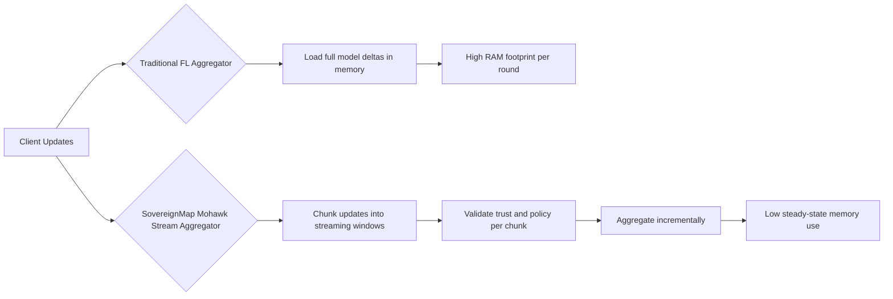
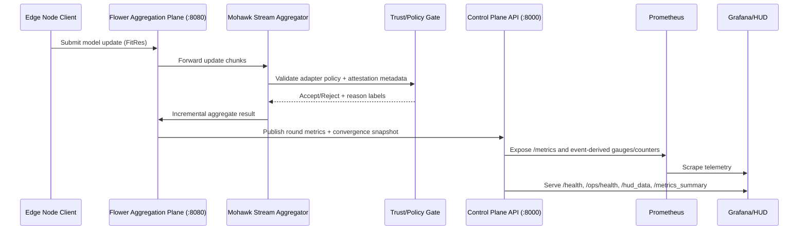

<!-- markdownlint-disable MD013 -->

# Sovereign Map Federated Learning

Production-grade federated learning platform that combines Byzantine-resilient aggregation, trust verification, governance policy controls, tokenomics telemetry, and full-stack observability.

## Live Project Pulse

[](https://github.com/rwilliamspbg-ops/Sovereign_Map_Federated_Learning/releases)
[](https://github.com/rwilliamspbg-ops/Sovereign_Map_Federated_Learning/commits/main)
[](https://github.com/rwilliamspbg-ops/Sovereign_Map_Federated_Learning)
[](https://github.com/rwilliamspbg-ops/Sovereign_Map_Federated_Learning/graphs/contributors)
[](https://github.com/rwilliamspbg-ops/Sovereign_Map_Federated_Learning/issues)
[](https://github.com/rwilliamspbg-ops/Sovereign_Map_Federated_Learning/pulls)
[](https://github.com/rwilliamspbg-ops/Sovereign_Map_Federated_Learning/stargazers)
[](https://github.com/rwilliamspbg-ops/Sovereign_Map_Federated_Learning/network/members)
[](LICENSE)

## Quick Architecture Overview

Sovereign Map uses a streaming aggregation model instead of loading full model updates into memory at once.

- Memory efficiency: Mohawk-style chunked processing reduces memory pressure by up to 224x for large update sets.
- Byzantine resilience: selective verification and trust scoring reduce adversarial impact with sublinear validation behavior for high node counts.
- Hardware root of trust: every node contributes attestation and certificate telemetry into the same operational control plane.



## Why Mohawk

Mohawk-style streaming aggregation treats model updates as a continuous stream of chunks rather than a monolithic tensor payload. This allows the coordinator to perform verification, filtering, and merge steps incrementally while retaining bounded working memory. In practice, this is what makes high fan-out node participation feasible on commodity infrastructure: memory usage scales with chunk window size instead of full global update size, while trust and policy checks run inline with aggregation.

## Platform Capability Badges

[](sovereignmap_production_backend_v2.py)
[](bridge-policies.json)
[](tpm_cert_manager.py)
[](tokenomics_metrics_exporter.py)
[](secure_communication.py)
[](prometheus.yml)
[](kubernetes-5000-node-manifests.yaml)

## Device Support Badges

[](frontend/src/HUD.jsx)
[](docker-compose.dev.yml)
[](README.md#quick-start)
[](run-demo-windows.ps1)
[](mobile-apps/android-node-app)
[](mobile-apps/ios-node-app)
[](README.md#hardware-requirements)
[](README.md#hardware-requirements)
[](README.md#hardware-requirements)
[](README.md#hardware-requirements)
[](docker-compose.full.yml)

## CI, Security, and Release Badges

### Core Quality Gates

[](https://github.com/rwilliamspbg-ops/Sovereign_Map_Federated_Learning/actions/workflows/build.yml)
[](https://github.com/rwilliamspbg-ops/Sovereign_Map_Federated_Learning/actions/workflows/lint.yml)
[](https://github.com/rwilliamspbg-ops/Sovereign_Map_Federated_Learning/actions/workflows/hil-tests.yml)
[](https://github.com/rwilliamspbg-ops/Sovereign_Map_Federated_Learning/actions/workflows/reproducibility-check.yml)
[](https://github.com/rwilliamspbg-ops/Sovereign_Map_Federated_Learning/actions/workflows/observability-ci.yml)
[](https://github.com/rwilliamspbg-ops/Sovereign_Map_Federated_Learning/actions/workflows/opencv-go-tests.yml)

### Security and Governance Gates

[](https://github.com/rwilliamspbg-ops/Sovereign_Map_Federated_Learning/actions/workflows/codeql-analysis.yml)
[](https://github.com/rwilliamspbg-ops/Sovereign_Map_Federated_Learning/actions/workflows/security-supply-chain.yml)
[](https://github.com/rwilliamspbg-ops/Sovereign_Map_Federated_Learning/actions/workflows/secret-scan.yml)
[](https://github.com/rwilliamspbg-ops/Sovereign_Map_Federated_Learning/actions/workflows/governance-check.yml)
[](https://github.com/rwilliamspbg-ops/Sovereign_Map_Federated_Learning/actions/workflows/workflow-action-pin-check.yml)
[](https://github.com/rwilliamspbg-ops/Sovereign_Map_Federated_Learning/actions/workflows/audit-check.yml)

### SDK and Release Engineering

[](https://github.com/rwilliamspbg-ops/Sovereign_Map_Federated_Learning/actions/workflows/sdk-security.yml)
[](https://github.com/rwilliamspbg-ops/Sovereign_Map_Federated_Learning/actions/workflows/sdk-version.yml)
[](https://github.com/rwilliamspbg-ops/Sovereign_Map_Federated_Learning/actions/workflows/sdk-publish.yml)
[](https://github.com/rwilliamspbg-ops/Sovereign_Map_Federated_Learning/actions/workflows/sdk-provenance.yml)
[](https://github.com/rwilliamspbg-ops/Sovereign_Map_Federated_Learning/actions/workflows/sdk-channels.yml)
[](https://github.com/rwilliamspbg-ops/Sovereign_Map_Federated_Learning/actions/workflows/contributor-rankings.yml)
[](https://github.com/rwilliamspbg-ops/Sovereign_Map_Federated_Learning/actions/workflows/docs-link-check.yml)
[](https://github.com/rwilliamspbg-ops/Sovereign_Map_Federated_Learning/actions/workflows/test-artifacts-review.yml)

### Deployment and Packaging

[](https://github.com/rwilliamspbg-ops/Sovereign_Map_Federated_Learning/actions/workflows/deploy.yml)
[](https://github.com/rwilliamspbg-ops/Sovereign_Map_Federated_Learning/actions/workflows/docker-build.yml)
[](https://github.com/rwilliamspbg-ops/Sovereign_Map_Federated_Learning/actions/workflows/windows-client-exe.yml)
[](https://github.com/rwilliamspbg-ops/Sovereign_Map_Federated_Learning/actions/workflows/phase3d-production-deploy.yml)

## What To Use This Software For

- Running secure, federated ML training across distributed nodes where raw data must stay local.
- Operating Byzantine-resilient model aggregation in adversarial or partially trusted environments.
- Building trust-aware AI infrastructure with policy controls, attestation signals, and auditable telemetry.
- Monitoring real-time FL, tokenomics, and system health through Prometheus and Grafana surfaces.
- Prototyping and scaling from local Docker deployments to large Compose/Kubernetes profiles.

## Hardware Requirements

| Node Class | Minimum (Functional) | Recommended (Sustained) |
| --- | --- | --- |
| Edge CPU Node | Raspberry Pi 4 (4 GB RAM), 4-core ARM CPU, 32 GB storage, Linux, TPM 2.0 device access | Raspberry Pi 5 / x86 mini PC (8-16 GB RAM), NVMe storage, TPM 2.0, stable wired network |
| Edge GPU/NPU Node | Jetson Nano / Intel NPU-capable edge device, 8 GB RAM, CUDA/NPU drivers | NVIDIA Jetson Orin / equivalent, 16+ GB RAM, tuned CUDA/NPU stack |
| Operator / Aggregator | 8 vCPU, 16 GB RAM, SSD, Docker Compose | 16+ vCPU, 32-64 GB RAM, NVMe, GPU optional, isolated monitoring host |
| Monitoring Stack | 2 vCPU, 4 GB RAM for Prometheus + Grafana | 4-8 vCPU, 8-16 GB RAM with longer retention and dashboard concurrency |

Use [hardware_auto_tuner.py](hardware_auto_tuner.py) to auto-profile host capability and choose an acceleration profile before large-scale runs.

## Technical Brief

Sovereign Map Federated Learning is a dual-plane runtime:

1. Aggregation plane: Flower-based federated coordination with Byzantine-robust strategy logic and convergence tracking.
2. Control and telemetry plane: Flask services for health, HUD, trust/policy operations, join lifecycle, and metrics publication.

Core characteristics:

- Byzantine-resilient training strategy with runtime convergence history.
- Trust and verification APIs for attestation-style governance workflows.
- Policy and join-management endpoints for operator-controlled enrollment.
- Prometheus-compatible metrics exporters for operational and tokenomics surfaces.
- Multi-profile deployment via Docker Compose and Kubernetes manifests.
- Hardware-aware tests spanning NPU, XPU, CUDA/ROCm, MPS, and CPU fallbacks.

## System Layout

- Backend aggregation and APIs: [sovereignmap_production_backend_v2.py](sovereignmap_production_backend_v2.py)
- Tokenomics metrics exporter: [tokenomics_metrics_exporter.py](tokenomics_metrics_exporter.py)
- TPM metrics exporter: [tpm_metrics_exporter.py](tpm_metrics_exporter.py)
- Frontend HUD: [frontend/src/HUD.jsx](frontend/src/HUD.jsx)
- Compose profiles: [docker-compose.dev.yml](docker-compose.dev.yml), [docker-compose.production.yml](docker-compose.production.yml), [docker-compose.full.yml](docker-compose.full.yml)
- Kubernetes scale profile: [kubernetes-5000-node-manifests.yaml](kubernetes-5000-node-manifests.yaml)

## Visual Walkthrough

Visual proof for this project should be treated as release evidence, not optional decoration.

Expected screenshot artifacts per release:

- Operations HUD: trust score, node participation, latency wall, and resilience indicators.
- Grafana Operations Overview: gauge deck + trend wall under live load.
- Grafana Tokenomics Overview: mint/bridge/validator/wallet health sections.

Tracked asset locations:

- `docs/screenshots/hud-operations-overview.png`
- `docs/screenshots/grafana-operations-overview.png`
- `docs/screenshots/grafana-tokenomics-overview.png`

Capture workflow and acceptance checklist:

- [docs/screenshots/README.md](docs/screenshots/README.md)

Current status: screenshot paths are defined and release capture workflow is documented; attach rendered PNG/GIF evidence in each tagged release.

## Dual-Plane Runtime Data Flow



## Capability Map

| Domain | Runtime Surfaces | Purpose |
| --- | --- | --- |
| Federated learning | [sovereignmap_production_backend_v2.py](sovereignmap_production_backend_v2.py), [src/client.py](src/client.py) | Round orchestration, aggregation, convergence |
| Trust and attestation | [tpm_cert_manager.py](tpm_cert_manager.py), [tpm_metrics_exporter.py](tpm_metrics_exporter.py), [secure_communication.py](secure_communication.py) | Identity, verification, trust signals |
| Governance and policy | [bridge-policies.json](bridge-policies.json), [capabilities.json](capabilities.json) | Runtime controls and policy surfaces |
| Tokenomics and economics | [tokenomics_metrics_exporter.py](tokenomics_metrics_exporter.py), [tokenomics_metrics_exporter.py](tokenomics_metrics_exporter.py) | Economic telemetry and dashboard inputs |
| Observability | [prometheus.yml](prometheus.yml), [alertmanager.yml](alertmanager.yml), [fl_slo_alerts.yml](fl_slo_alerts.yml) | Metrics collection, alerting, SLO validation |
| Operations | [deploy.sh](deploy.sh), [deploy_demo.sh](deploy_demo.sh), [Makefile](Makefile) | Deployment and repeatable operator workflows |

## Detailed Functions Reference

### Backend API Functions

Live API examples and integration snippets:

- [docs/api/http-examples.md](docs/api/http-examples.md)

OpenAPI/Postman status:

- A full OpenAPI specification is not yet published in-repo.
- Until that lands, use the HTTP example catalog above as the canonical integration quick start.

| Endpoint | Method | Function | Responsibility |
| --- | --- | --- | --- |
| /health | GET | health | Service health, enclave status, HUD telemetry snapshot |
| /status | GET | status | Aggregator runtime identity and core port map |
| /chat | POST | chat_query | HUD assistant query handling for operator prompts |
| /hud_data | GET | hud_data | HUD metrics including audit accuracy and simulation counters |
| /founders | GET | get_founders | Founding-signature identity list for governance views |
| /trigger_fl | POST | trigger_fl_round | Manual FL round simulation and convergence updates |
| /create_enclave | POST | create_enclave | Enclave state transition workflow |
| /convergence | GET | get_convergence | Convergence history arrays for charting |
| /metrics_summary | GET | metrics_summary | Aggregated metrics summary across runtime domains |
| /model_registry | GET | model_registry_recent | Recent persisted model metadata and round snapshots |
| /simulate/<simulation_type> | POST | trigger_hud_simulation | Records HUD simulation events by scenario type |
| /ops/health | GET | ops_health | Operational dependency/system snapshot (ports, memory/disk pressure, Prometheus reachability) |
| /ops/events/recent | GET | ops_events_recent | Returns recent operations events for timeline replay |
| /ops/events | GET (SSE) | ops_events_stream | Server-sent event stream for live operations telemetry |

### Trust, Policy, and Join Lifecycle Functions

| Endpoint | Method | Function | Responsibility |
| --- | --- | --- | --- |
| /trust_snapshot | GET | trust_snapshot | Current trust mode, policy state, and policy history |
| /verification_policy | POST | update_verification_policy | Runtime policy update surface |
| /llm_policy | GET | llm_policy_view | Exposes active LLM adapter validation policy |
| /join/policy | GET | join_policy_view | Join bootstrap policy and onboarding constraints |
| /join/invite | POST | create_join_invite | Issue join invites with bounded TTL and permissions |
| /join/register | POST | register_join_participant | Register participant certificates and join metadata |
| /join/registrations | GET | list_join_registrations | Admin listing of registered participants |
| /join/revoke/<int:node_id> | POST | revoke_join_participant | Administrative revocation of participant certificate |

### Training Control Functions

| Endpoint | Method | Function | Responsibility |
| --- | --- | --- | --- |
| /training/start | POST | start_training | Trigger training start signal for HUD/ops flows |
| /training/stop | POST | stop_training | Trigger training halt signal |
| /training/status | GET | training_status | Current mocked training progress and metrics view |

### Tokenomics Exporter Functions

| Endpoint | Method | Function | Responsibility |
| --- | --- | --- | --- |
| /metrics | GET | metrics | Prometheus exposition endpoint for tokenomics gauges |
| /health | GET | health | Tokenomics exporter liveness and source-file metadata |
| /event/tokenomics | POST | event_tokenomics | Ingest tokenomics events and persist canonical payload |

### TPM Exporter Functions

| Endpoint | Method | Function | Responsibility |
| --- | --- | --- | --- |
| /metrics | GET | metrics | Prometheus exposition endpoint for TPM/trust metrics |
| /metrics/summary | GET | metrics_summary | Aggregated TPM/trust summary snapshot |
| /health | GET | health | TPM exporter liveness and metadata |
| /event/attestation | POST | event_attestation | Ingest attestation event payloads |
| /event/message | POST | event_message | Ingest trust-related operational messages |

### Endpoint Contract Notes

- Auth boundaries: `/join/registrations` and `/join/revoke/<int:node_id>` are admin-gated and require valid admin authorization headers.
- Auth boundaries: `/verification_policy` supports role-aware updates via `X-API-Role` and optional bearer token wiring.
- Status code behavior: `/create_enclave` may return `202` while provisioning is in progress, then `200` once a stable state transition is reached.
- Status code behavior: `/trigger_fl` may return `202` for accepted async execution and non-2xx when round execution cannot proceed.
- Streaming semantics: `/ops/events` is an SSE endpoint and includes heartbeat events to keep long-lived clients connected.
- Streaming semantics: `/ops/events/recent` should be used to backfill timeline state before attaching to SSE.

### Key Internal Runtime Functions

| Function | File | Responsibility |
| --- | --- | --- |
| validate_llm_adapter_update | [sovereignmap_production_backend_v2.py](sovereignmap_production_backend_v2.py) | Policy validation gate for incoming client updates |
| build_tokenomics_payload | [sovereignmap_production_backend_v2.py](sovereignmap_production_backend_v2.py) | Constructs tokenomics publication payload from FL state |
| publish_tokenomics_event | [sovereignmap_production_backend_v2.py](sovereignmap_production_backend_v2.py) | Sends tokenomics telemetry to exporter endpoint |
| publish_tpm_attestation_events | [sovereignmap_production_backend_v2.py](sovereignmap_production_backend_v2.py) | Emits attestation events for trust metrics pipeline |
| run_flower_server | [sovereignmap_production_backend_v2.py](sovereignmap_production_backend_v2.py) | Starts and configures Flower aggregation server |
| run_flask_metrics | [sovereignmap_production_backend_v2.py](sovereignmap_production_backend_v2.py) | Starts Flask API plane for control and telemetry |
| create_app | [tokenomics_metrics_exporter.py](tokenomics_metrics_exporter.py) | Constructs exporter app and endpoint bindings |

## Quick Start

### Prerequisites

- Go 1.25+
- Node.js 20+
- npm 10+
- Python 3.11+
- Docker with Compose plugin

### Option A: Genesis bootstrap

```bash
git clone https://github.com/rwilliamspbg-ops/Sovereign_Map_Federated_Learning.git
cd Sovereign_Map_Federated_Learning
./genesis-launch.sh
```

### Option B: Local dev stack

```bash
docker compose -f docker-compose.dev.yml up -d
docker compose ps
```

### Verify stack health (required)

```bash
curl -s http://localhost:8000/status | jq
curl -s http://localhost:8000/health | jq
curl -s http://localhost:8000/ops/health | jq
curl -s http://localhost:8000/training/status | jq
```

Expected checkpoints:

- `/status` returns service identity and ports.
- `/ops/health` reports API, Flower, and Prometheus reachability.
- frontend HUD is reachable at `http://localhost:3000`.
- Grafana is reachable at `http://localhost:3001`.

### First training round (Hello World)

CLI flow:

```bash
# Trigger one global round
curl -s -X POST http://localhost:8000/trigger_fl | jq

# Verify round advanced and metrics updated
curl -s http://localhost:8000/metrics_summary | jq '.federated_learning.current_round, .federated_learning.current_accuracy, .federated_learning.current_loss'
curl -s http://localhost:8000/convergence | jq '.current_round, .current_accuracy, .current_loss'
```

UI flow:

1. Open `http://localhost:3000`.
2. Switch to **Network Operations HUD**.
3. Click **Run Global FL Epoch**.
4. Confirm the live timeline shows a `TRAINING_ROUND` event and round metrics increment.

### Option C: Full profile with participant scaling

```bash
docker compose -f docker-compose.full.yml up -d --scale node-agent=5
```

## Build and Validation Commands

```bash
# Go and backend tests
go test ./... -count=1

# Monorepo package build and tests
npm ci
npm run build:libs
npm run test:ci

# Frontend build
npm --prefix frontend ci
npm --prefix frontend run build
```

## Contributor First Steps

Before opening a PR, run the same fast checks maintainers use:

```bash
# Discover all available developer targets
make help

# Required baseline
make fmt
make lint
make test

# Recommended reproducibility smoke checks
make smoke
```

For runtime-focused changes (HUD, observability, policy endpoints), include at least one local verification artifact in your PR description:

- `/health` and `/ops/health` output snippet.
- one screenshot from HUD or Grafana.
- command log showing a successful `trigger_fl` round.

## Deployment Profiles

- Development: [docker-compose.dev.yml](docker-compose.dev.yml)
- Production: [docker-compose.production.yml](docker-compose.production.yml)
- Full topology: [docker-compose.full.yml](docker-compose.full.yml)
- Monitoring stack: [docker-compose.monitoring.yml](docker-compose.monitoring.yml)
- Large-scale variants: [docker-compose.large-scale.yml](docker-compose.large-scale.yml), [docker-compose.1000nodes.yml](docker-compose.1000nodes.yml), [docker-compose.200nodes.yml](docker-compose.200nodes.yml)

## Repository Standards

- Contribution guidelines: [CONTRIBUTING.md](CONTRIBUTING.md)
- Security policy: [SECURITY.md](SECURITY.md)
- Changelog: [CHANGELOG.md](CHANGELOG.md)
- License: [LICENSE](LICENSE)

## Help Wanted: Quick Wins

If you want to contribute quickly, these areas have high impact and low setup friction:

- Test matrix expansion for TPM 2.0 hardware variants and Docker runtimes.
- Apple Silicon (MPS) acceleration optimization and benchmark baselines.
- Additional Grafana panel tuning for high-cardinality node fleets.
- Better synthetic fault workloads for Byzantine and partition simulation paths.

Contribution process and coding standards are in [CONTRIBUTING.md](CONTRIBUTING.md).

## Common Issues

### TPM device access in Docker (`/dev/tpm0`)

- Symptom: trust/attestation metrics stay flat or backend cannot initialize TPM flows.
- Check: container runtime must expose TPM devices and required permissions.
- Typical fix: run with explicit device mapping and appropriate group permissions for TPM access.

### Port conflicts (frontend/backend/observability)

- Symptom: HUD shows backend unreachable or Grafana/Prometheus endpoints fail to bind.
- Check: local services already using frontend/backend ports.
- Typical fix: align Compose port mappings and frontend API base configuration so HUD and backend targets match.

## Sanity Report

Timestamp: 2026-03-19

### Functional sanity checks completed

- Tokenomics exporter handles directory-valued source path safely and persists payload without IsADirectoryError.
- HUD simulation controls are wired end-to-end (frontend action -> backend endpoint -> HUD counter surface).
- Backend and exporter modules compile successfully with Python syntax checks.

### CI sanity checks completed

Verified green on main after latest changes:

- Build and Test
- Lint Code Base
- HIL Tests
- Reproducibility Check
- Governance Check
- Workflow Action Pin Check
- CodeQL Security Analysis
- Security Supply Chain
- Secret Scan
- Observability CI
- Build and Deploy

### Operational recommendation

For release candidates, run one additional live smoke test using [docker-compose.full.yml](docker-compose.full.yml) and verify /health, /hud_data, and /event/tokenomics before tagging.

Standalone report: [SANITY_REPORT.md](SANITY_REPORT.md)
