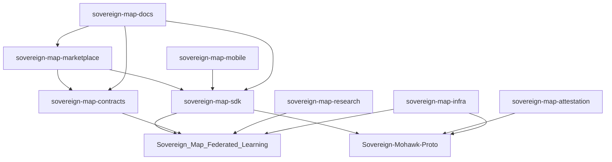

# 🗺️ Sovereign Map Ecosystem - Strategic Expansion Plan

## Current Ecosystem Analysis


- ✅ **Sovereign_Map_Federated_Learning** - Protocol core (Python)
- ✅ **Sovereign-Mohawk-Proto** - Runtime orchestration (Go + Wasmtime)
- ✅ **Autonomous-Mapping** - 3D mapping client (TypeScript/React)

---

## 🎯 Critical Missing Components

### 1. **SDK & Developer Tools Repository**
**Name:** `sovereign-map-sdk`

**Purpose:** Lower the barrier to entry for third-party developers

**Components:**
```
sovereign-map-sdk/
├── sdk/
│   ├── python/           # Python client for federated learning
│   ├── javascript/       # Browser/Node.js SDK
│   ├── rust/            # Native performance SDK
│   └── go/              # Go SDK for backend integration
├── examples/
│   ├── basic-node/      # Minimal Genesis Node setup
│   ├── map-query/       # Real-time map queries
│   ├── custom-model/    # Train custom perception models
│   └── analytics/       # Privacy-preserving analytics
├── docs/
│   ├── quickstart.md
│   ├── api-reference/
│   └── tutorials/
└── tools/
    ├── node-simulator/  # Local testnet simulator
    └── privacy-debugger/ # SGP-001 compliance checker
```

**Why Critical:**
- Current ecosystem requires deep protocol knowledge
- No clear onboarding path for developers
- Would accelerate ecosystem adoption by 10x

---

### 2. **Smart Contract & Tokenomics Repository**
**Name:** `sovereign-map-contracts`

**Purpose:** Economic layer and on-chain governance

**Components:**
```
sovereign-map-contracts/
├── contracts/
│   ├── RewardDistributor.sol    # Handles node rewards
│   ├── GovernanceDAO.sol        # SGP proposal system
│   ├── StakingVault.sol         # Node staking mechanism
│   ├── MapDataMarket.sol        # Privacy-preserving data marketplace
│   └── CrossChainBridge.sol     # Multi-chain integration
├── economics/
│   ├── tokenomics-model.py      # Economic simulation
│   ├── incentive-analysis/      # ROI calculators
│   └── attack-vectors.md        # Economic security analysis
├── governance/
│   ├── SGP-template.md
│   └── proposals/               # Historical SGPs
└── audits/
    └── [pending-audits]
```

**Key Features:**
- EIP-2535 Diamond Pattern for upgradability
- Integration with Polygon AggLayer (current roadmap item)
- Sybil resistance mechanisms
- Dynamic privacy budget allocation

**Why Critical:**
- Economic incentives are core to DePIN success
- Need transparent, auditable reward distribution
- DAO governance essential for protocol evolution

---

### 3. **Hardware Attestation & Security Repository**
**Name:** `sovereign-map-attestation`

**Purpose:** Cryptographic hardware verification

**Components:**
```
sovereign-map-attestation/
├── tpm/
│   ├── tpm2-interface/       # TPM 2.0 integration
│   ├── remote-attestation/   # Network verification
│   └── key-generation/       # Secure key derivation
├── tee/
│   ├── sgx-enclave/          # Intel SGX support
│   ├── trustzone/            # ARM TrustZone
│   └── sev-snp/              # AMD SEV-SNP
├── bootchain/
│   ├── measured-boot/        # UEFI Secure Boot integration
│   └── firmware-validation/
├── dauth/
│   ├── coordinator-less-proof/ # Current dAuth implementation
│   └── consensus/            # Byzantine fault tolerance
└── benchmarks/
    └── attestation-performance/
```

**Why Critical:**
- Hardware attestation is mentioned but not implemented
- Essential for preventing Sybil attacks
- Differentiator from other DePIN projects
- Required for enterprise adoption

---

### 4. **Data Marketplace & Analytics Repository**
**Name:** `sovereign-map-marketplace`

**Purpose:** Privacy-preserving data monetization

**Components:**
```
sovereign-map-marketplace/
├── marketplace/
│   ├── api/                  # GraphQL/REST API
│   ├── pricing-engine/       # Dynamic pricing based on scarcity
│   └── access-control/       # Fine-grained permissions
├── analytics/
│   ├── differential-privacy/ # DP query engine (SGP-001)
│   ├── aggregation/          # Multi-node aggregation
│   └── visualization/        # Dashboard for data buyers
├── integrations/
│   ├── autonomous-vehicles/  # AV fleet API
│   ├── robotics/            # Robot OS integration
│   └── ar-vr/               # AR/VR platform connectors
└── compliance/
    ├── gdpr/                # European compliance
    ├── ccpa/                # California compliance
    └── audit-trails/        # Cryptographic audit logs
```

**Why Critical:**
- Needs clear path to revenue for node operators
- Data buyers need easy access
- Privacy compliance is non-negotiable
- Marketplace creates network effects

---

### 5. **Mobile & Edge Clients Repository**
**Name:** `sovereign-map-mobile`

**Purpose:** Consumer-grade participation

**Components:**
```
sovereign-map-mobile/
├── ios/
│   ├── ARKit-integration/    # Apple LiDAR sensor
│   └── CoreML-models/        # On-device inference
├── android/
│   ├── ARCore-integration/   # Google AR platform
│   └── TFLite-models/        # TensorFlow Lite models
├── shared/
│   ├── camera-calibration/   # Cross-platform calibration
│   ├── mesh-sync/           # P2P synchronization
│   └── privacy-controls/    # User-facing SGP-001 controls
└── lite-node/
    ├── reduced-precision/    # Lower hardware requirements
    └── async-sync/          # Background synchronization
```

**Why Critical:**
- Billions of smartphones have advanced sensors
- Lowers entry barrier from specialized hardware
- Massive network expansion potential
- Real-world data collection at scale

---

### 6. **Benchmarking & Research Repository**
**Name:** `sovereign-map-research`

**Purpose:** Academic validation and performance metrics

**Components:**
```
sovereign-map-research/
├── benchmarks/
│   ├── kitti-dataset/        # Standard autonomous driving benchmark
│   ├── tum-rgbd/            # RGB-D SLAM benchmark
│   └── sovereign-bench/      # Custom benchmark suite
├── papers/
│   ├── sgp-001-whitepaper/   # Privacy standard formalization
│   ├── dauth-protocol/       # Coordinator-less verification
│   └── economic-model/       # Tokenomics analysis
├── simulations/
│   ├── 1000-node/           # Current v0.2.0-alpha simulation
│   ├── 10k-node/            # Next milestone
│   └── 100k-node/           # Production scale
└── collaborations/
    ├── mit-csail/           # Mentioned in README
    ├── tum-cv/              # Mentioned in README
    └── stanford-blockchain/ # Mentioned in README
```

**Why Critical:**
- Academic credibility attracts institutional investors
- Benchmarks prove performance claims
- Publications drive awareness
- Research partnerships provide validation

---

### 7. **Infrastructure & DevOps Repository**
**Name:** `sovereign-map-infra`

**Purpose:** Production-grade deployment

**Components:**
```
sovereign-map-infra/
├── kubernetes/
│   ├── genesis-node/         # Node orchestration
│   ├── relay-node/           # Future bandwidth amplification
│   └── monitoring/           # Prometheus + Grafana
├── terraform/
│   ├── aws/                 # Cloud deployments
│   ├── gcp/
│   └── bare-metal/          # On-premise configurations
├── ansible/
│   ├── node-provisioning/
│   └── security-hardening/
├── monitoring/
│   ├── metrics-exporters/
│   ├── alerting-rules/
│   └── dashboards/
└── disaster-recovery/
    ├── backup-strategies/
    └── network-partitioning/
```

**Why Critical:**
- Node operators need production-ready tooling
- Reduces operational complexity
- Improves network reliability
- Essential for enterprise customers

---

### 8. **Documentation & Community Repository**
**Name:** `sovereign-map-docs`

**Purpose:** Centralized knowledge base

**Components:**
```
sovereign-map-docs/
├── docs/
│   ├── architecture/         # System design docs
│   ├── api/                 # API documentation
│   ├── tutorials/           # Step-by-step guides
│   └── faq/                 # Common questions
├── blog/
│   ├── technical/           # Deep dives
│   └── announcements/       # Network updates
├── community/
│   ├── ambassador-program/
│   ├── bug-bounty/
│   └── contribution-guide/
└── translations/
    ├── zh-CN/               # Chinese
    ├── es/                  # Spanish
    └── ja/                  # Japanese
```

**Why Critical:**
- Single source of truth
- Reduces support burden
- Enables community growth
- International expansion

---

## 🚀 Implementation Priority

### Phase 1: Foundation (0-3 months)
1. **sovereign-map-sdk** - Essential for developer onboarding
2. **sovereign-map-docs** - Required for all other repos
3. **sovereign-map-attestation** - Security foundation

### Phase 2: Economics (3-6 months)
4. **sovereign-map-contracts** - Enable economic incentives
5. **sovereign-map-marketplace** - Revenue generation
6. **sovereign-map-research** - Validate economic model

### Phase 3: Scale (6-12 months)
7. **sovereign-map-mobile** - Consumer adoption
8. **sovereign-map-infra** - Production readiness

---

## 📊 Ecosystem Maturity Metrics

### Current State
- **Core Protocol:** 70% complete (missing production hardening)
- **Developer Tools:** 15% complete (basic examples only)
- **Economic Layer:** 10% complete (whitepaper stage)
- **Security:** 40% complete (SGP-001 spec, missing attestation)
- **Documentation:** 30% complete (fragmented across repos)

### Target State (12 months)
- **Core Protocol:** 95% (audited, battle-tested)
- **Developer Tools:** 85% (comprehensive SDK + examples)
- **Economic Layer:** 90% (deployed, liquidity bootstrapped)
- **Security:** 95% (full attestation + audits)
- **Documentation:** 90% (multi-language, video tutorials)

---

## 🔗 Cross-Repository Dependencies



---

## 💡 Additional Recommendations

### 1. **Repository Consolidation**
- Archive or clearly deprecate `Sovereign-Map` and `Sovereign-Map-V2`
- Add deprecation notices pointing to current repos
- Create migration guides if needed

### 2. **Branding Consistency**
- Standardize naming: `sovereign-map-X` vs `Sovereign-X`
- Update all READMEs with consistent architecture diagrams
- Create shared assets repository for logos/graphics

### 3. **CI/CD Pipeline**
- Add GitHub Actions for cross-repo testing
- Implement automated SGP-001 compliance checks
- Set up nightly builds for all components

### 4. **Community Building**
- Create Discord server with dedicated channels per repo
- Launch ambassador program for technical evangelism
- Establish monthly community calls

### 5. **Security Posture**
- Engage reputable auditors (Trail of Bits, OpenZeppelin)
- Launch bug bounty program
- Implement security disclosure policy

---

## 🎯 Success Criteria

**6-Month Goals:**
- [ ] 100+ developers using SDK
- [ ] 50+ Genesis Nodes in testnet
- [ ] 3+ academic papers submitted
- [ ] 1 complete security audit
- [ ] 5,000+ Discord members

**12-Month Goals:**
- [ ] 1,000+ Genesis Nodes in production
- [ ] $10M+ total value locked in contracts
- [ ] 10+ enterprise integrations
- [ ] Top 50 DePIN project by market cap
- [ ] 100,000+ mobile app installs

---

## 📋 Action Items (Next 30 Days)

1. **Create `sovereign-map-sdk` repository**
   - Python SDK for federated learning
   - Basic example: "Run a Genesis Node in 5 minutes"
   
2. **Enhance `sovereign-map-docs`**
   - Architecture overview diagram
   - API reference for existing endpoints
   - FAQ addressing common concerns

3. **Prototype `sovereign-map-attestation`**
   - TPM 2.0 simulator
   - dAuth protocol specification
   - Remote attestation proof-of-concept

4. **Economic Modeling**
   - Python simulation of reward distribution
   - Break-even analysis for node operators
   - Token supply schedule

5. **Community Infrastructure**
   - Discord server setup
   - Contributing guidelines
   - Code of conduct

---

## 🤝 Collaboration Opportunities

### Academic Partnerships
- **MIT CSAIL**: Differential privacy research
- **TUM Computer Vision**: ORB-SLAM3 optimizations
- **Stanford Blockchain**: Economic mechanism design

### Industry Partnerships
- **Autonomous Vehicle OEMs**: Data buyers
- **Robotics Companies**: Spatial intelligence API
- **AR/VR Platforms**: Consumer applications

### DePIN Ecosystem
- **Helium**: Cross-chain IoT network effects
- **Filecoin**: Decentralized storage for map tiles
- **The Graph**: Indexing spatial data

---

## 📚 References

- [DePIN Sector Map 2025](https://messari.io/report/depin-sector-map)
- [Federated Learning Best Practices](https://arxiv.org/abs/1912.04977)
- [Differential Privacy Book](https://programming-dp.com/)
- [Hardware Attestation Standards](https://trustedcomputinggroup.org/)

---

**Next Steps:** Select top 3 repositories from this plan and create detailed implementation roadmaps.
