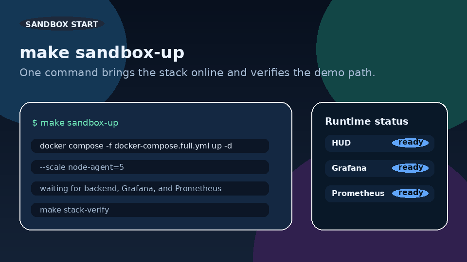
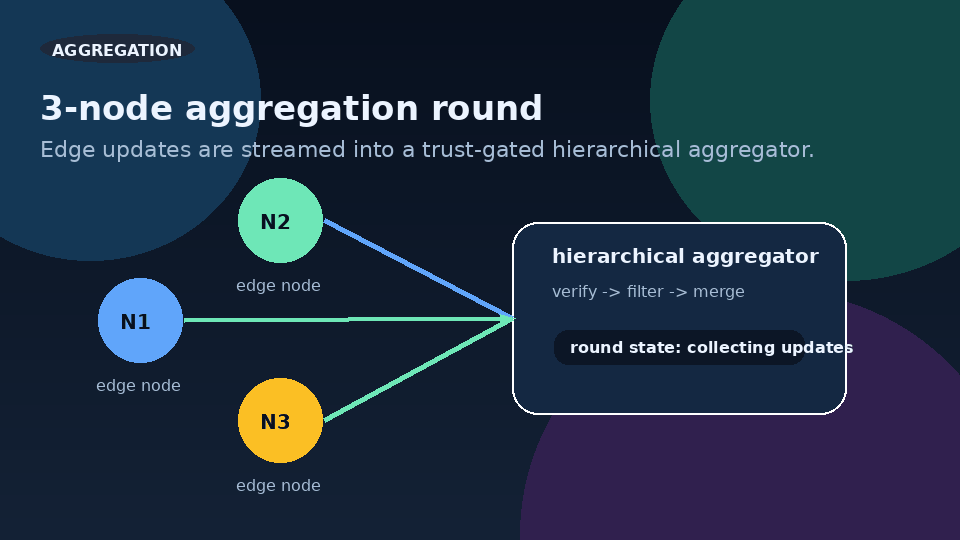
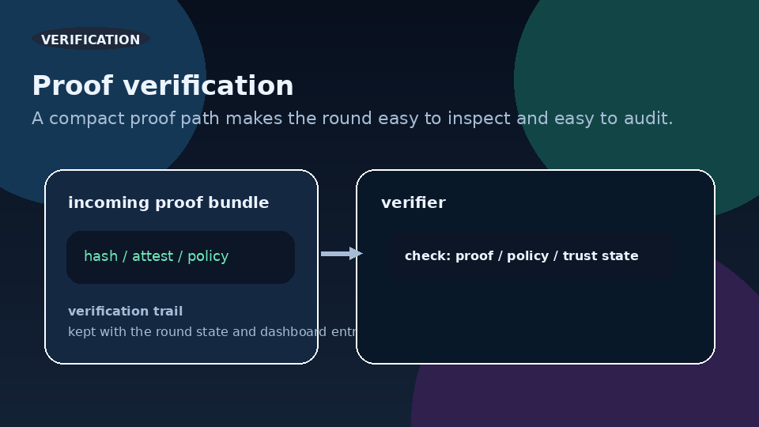

<!-- markdownlint-disable MD013 -->

# Sovereign Mohawk Proto

> **A formally verified federated learning runtime that scales to 10 million nodes with Byzantine resilience and quantum-resistant security - while keeping data private on the edge.**

This landing page is the public front door for the project. It is intentionally short, visual, and focused on the first run: start the stack, see the hierarchy of trust, and inspect the proof path without digging through the full technical brief.

[](https://github.com/rwilliamspbg-ops/Sovereign_Map_Federated_Learning/actions/workflows/build.yml)
[](https://go.dev/)
[](https://github.com/rwilliamspbg-ops/Sovereign_Map_Federated_Learning/blob/main/LICENSE)
[](https://github.com/rwilliamspbg-ops/Sovereign_Map_Federated_Learning/blob/main/results/README.md)
[](https://discord.gg/raBz79CJ)

## What You Get in 60 Seconds

- Start a local sandbox with one command.
- Watch three edge nodes aggregate into a trust-gated runtime.
- Verify proofs and state in the same observability surface operators use.

## Try It Now

```bash
make sandbox-up
```

Then open:

- HUD: http://localhost:3000
- Grafana: http://localhost:3001
- Prometheus: http://localhost:9090

Quick links:

- README: [Project overview](https://github.com/rwilliamspbg-ops/Sovereign_Map_Federated_Learning/blob/main/README.md)
- Repo docs: [Documentation hub](https://github.com/rwilliamspbg-ops/Sovereign_Map_Federated_Learning/blob/main/docs/README.md)
- Contributing: [CONTRIBUTING.md](https://github.com/rwilliamspbg-ops/Sovereign_Map_Federated_Learning/blob/main/CONTRIBUTING.md)
- Security: [SECURITY.md](https://github.com/rwilliamspbg-ops/Sovereign_Map_Federated_Learning/blob/main/SECURITY.md)

## Media Pack

<p align="center">
  
  
  
</p>

<p align="center">
  
  
</p>

<p align="center">
  
  
</p>

## Why It Matters

Traditional federated learning fails at scale when trust has to be assumed, communication gets expensive, and one coordinator becomes a single point of failure. Sovereign Mohawk Proto replaces that with hierarchical aggregation, inline verification, TPM-backed sovereignty, and a post-quantum migration path so the edge stays private while the system remains auditable.

## Compare

| Capability | Sovereign Mohawk Proto | NVIDIA FLARE | PySyft |
| --- | --- | --- | --- |
| Scale model | Hierarchical, stream-friendly, edge-first | Enterprise orchestration | Privacy-first workflows |
| Trust | TPM-backed and verifiable | Deployment policy driven | Policy-based privacy |
| Proof path | zk-style verification and audit trail | Not the primary focus | Depends on integration |
| PQC posture | Explicit migration track | Not native | Not native |

## Contribute

Need help or want to jump in?

- Good first issues: [CONTRIBUTING.md](https://github.com/rwilliamspbg-ops/Sovereign_Map_Federated_Learning/blob/main/CONTRIBUTING.md)
- Code of conduct: [CODE_OF_CONDUCT.md](https://github.com/rwilliamspbg-ops/Sovereign_Map_Federated_Learning/blob/main/CODE_OF_CONDUCT.md)
- Security: [SECURITY.md](https://github.com/rwilliamspbg-ops/Sovereign_Map_Federated_Learning/blob/main/SECURITY.md)
- Roadmap: [Documentation/Project/ROADMAP.md](https://github.com/rwilliamspbg-ops/Sovereign_Map_Federated_Learning/blob/main/Documentation/Project/ROADMAP.md)

Looking for help with NPU ports, auditors for theorems, or Python SDK improvements.

## Launch Notes

- Last validated: 2026-04-15
- Public Discord: https://discord.gg/raBz79CJ
- Repo source: https://github.com/rwilliamspbg-ops/Sovereign_Map_Federated_Learning
